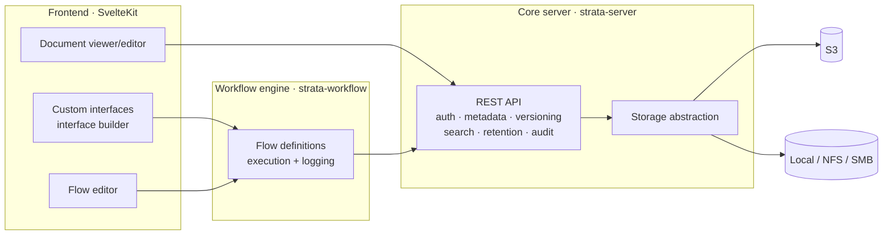

# Strata

**An open-source document management system that adapts to you — not the other way around.**

Strata is a highly customizable, self-hosted DMS built as three cleanly separated layers: a fast Rust core that abstracts *where* documents live, a visual workflow engine that lets every department decide *how* documents move, and a frontend with a built-in interface builder that lets teams shape *what* they see — all without writing code, and with full code access when they want it.

> ⚠️ **Status: early groundwork.** The architecture is defined and the skeleton compiles, but Strata is not usable yet. Follow the issues for progress.

## Architecture



| Layer | Directory | Responsibility |
|---|---|---|
| **Core server** | `crates/strata-server` | System of record: documents, metadata, versioning, permissions, audit, retention, search. Only layer that touches storage. |
| **Storage abstraction** | `crates/strata-storage` | `StorageProvider` trait with pluggable backends (local FS today; S3, SMB planned). |
| **Workflow engine** | `crates/strata-workflow` | Stores and executes user-defined flows (JSON graphs) with per-execution logging. |
| **Shared types** | `crates/strata-common` | Types that cross service boundaries. |
| **Frontend** | `frontend/` | SvelteKit app: visual flow editor, no-code interface builder, document viewer. |

Planned integrations: **Collabora Online / ONLYOFFICE** (document viewing & editing via WOPI) and **Stirling PDF** (PDF manipulation as workflow steps) — both as optional containers.

## Development

Prerequisites: Rust (stable), Node.js ≥ 22.

```bash
# Core server (http://localhost:8080/healthz)
cargo run -p strata-server

# Workflow engine (http://localhost:8081/healthz)
cargo run -p strata-workflow

# Frontend (http://localhost:5173)
cd frontend && npm install && npm run dev
```

Before pushing:

```bash
cargo fmt --check && cargo clippy --workspace -- -D warnings && cargo test --workspace
cd frontend && npm run lint && npm run check && npm run test:unit -- --run
```

## License

[AGPL-3.0-or-later](LICENSE) — Strata is and stays open source, including when offered as a hosted service.

---

A [Firn Labs](https://github.com/firn-labs) project.
